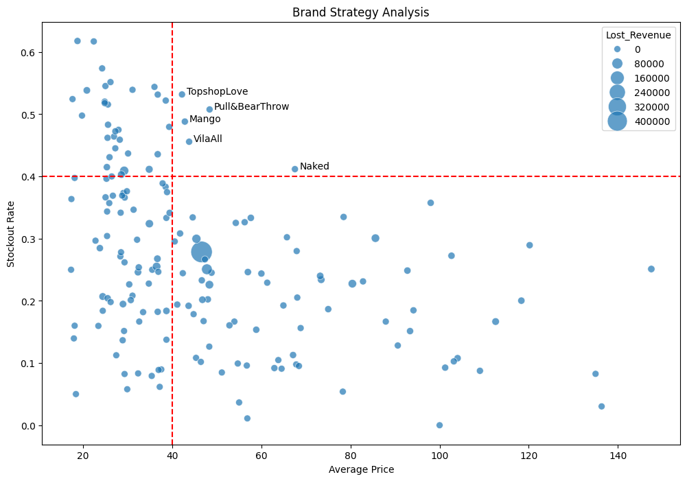

# Fashion Retail Brand Performance Analysis

## Project Overview

This project analyzes fashion retail brand performance to identify inventory inefficiencies, revenue leakage, and pricing opportunities.

Using stockout rates, average selling prices, and estimated lost revenue, brands are segmented into strategic categories to support inventory optimization and commercial decision-making.

---

## Business Problem

Fashion retailers frequently face the challenge of balancing inventory availability with customer demand.

Poor inventory planning can lead to:

- Lost sales from stockouts
- Reduced customer satisfaction
- Revenue leakage
- Inefficient allocation of inventory resources

This analysis investigates how stockout performance and pricing vary across brands and identifies opportunities for operational improvement.

---

## Objectives

- Measure stockout performance by brand
- Estimate revenue lost due to inventory shortages
- Compare pricing strategies across brands
- Segment brands into actionable business categories
- Generate data-driven recommendations

---

## Dataset

The dataset contains product-level information including:

- Brand
- Product Category
- Selling Price
- Inventory Availability
- Stockout Indicators
- Estimated Revenue Impact

---

## Methodology

1. Data Cleaning and Validation
2. Exploratory Data Analysis (EDA)
3. Brand-Level Aggregation
4. Revenue Loss Estimation
5. Brand Segmentation Analysis
6. Visualization and Business Recommendations

---

## Key Findings

### High Revenue Risk Brands
Several brands exhibited high stockout rates while maintaining strong demand, resulting in significant estimated revenue loss.

### Pricing Opportunities
Premium-priced brands showed lower inventory availability compared to mid-priced competitors.

### Inventory Optimization Potential
Targeted inventory allocation could reduce stockout-related revenue leakage while improving customer experience.

---

## Brand Strategy Matrix

---

## Tools & Technologies

- Python
- Pandas
- NumPy
- Matplotlib
- Seaborn
- Google Colab

---

## Repository Structure

fashion-brand-performance-analysis/
│
├── README.md
├── requirements.txt
│
├── data/
│   ├── raw/
│   └── processed/
│
├── notebooks/
│   └── Fashion_Brand_Analysis.ipynb
│
├── src/
│   └── main.py
│
└── outputs/
    └── brand_strategy_matrix.png

---

## Business Impact

This project demonstrates how data analytics can be used to:

- Identify hidden revenue leakage
- Improve inventory allocation decisions
- Support pricing strategy optimization
- Enable data-driven retail decision making

